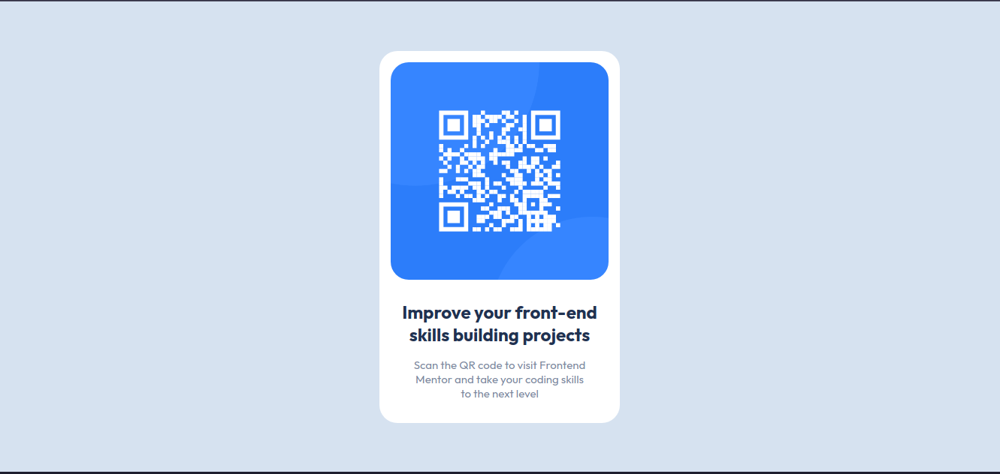

# Frontend Mentor - QR code component solution

This is a solution to the [QR code component challenge on Frontend Mentor](https://www.frontendmentor.io/challenges/qr-code-component-iux_sIO_H). Frontend Mentor challenges help you improve your coding skills by building realistic projects. 

## Overview

***

### The challenge

### Screenshot

Desktop view:

Mobile view:

### Links

- Solution URL: [here](https://github.com/kevst-dev/interactive-rating-frontend-mentor)
- Live Site URL: [here](https://kevst-dev.github.io/interactive-rating-frontend-mentor/)

## My process

---

### Built with

- Semantic HTML5 markup
- CSS custom properties
- Flexbox
- Mobile-first workflow
- Vanilla JS

## Author

---

- Website - [Add your name here](https://www.your-site.com)
- Frontend Mentor - [@yourusername
